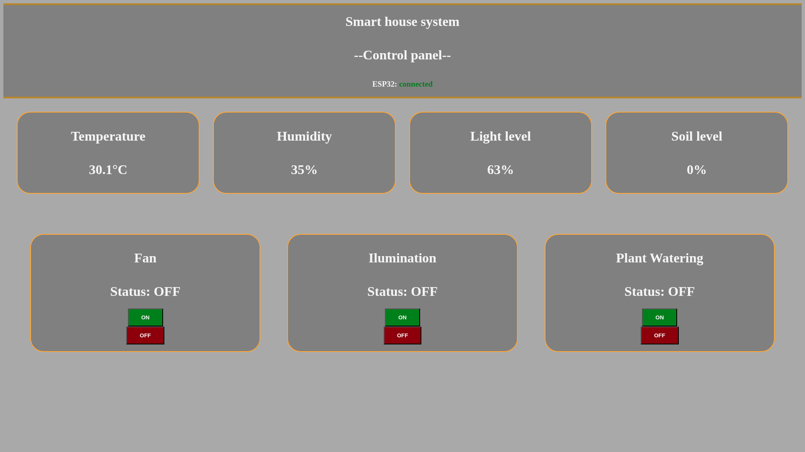
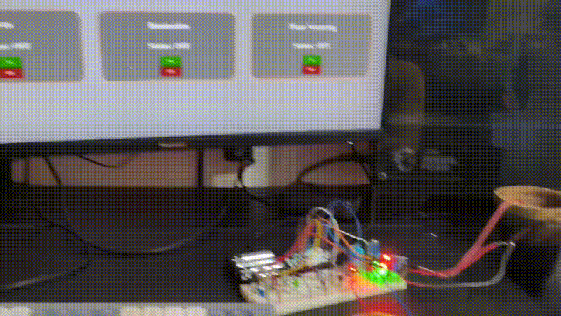

# ESP32 SMART HOUSE

The ESP32 Smart House allows you to easily control your house and interact with real-life objects just by clicking a button. It also allows you to be aware of your surroundings with data such as temperature and humidity.

It uses the WebSocket protocol to provide bidirectional, fast communication between devices, allowing data to be refreshed faster than with HTTP polling.

Using LittleFS, the web page contents (HTML, JS, and CSS) are stored locally in the internal flash memory of the ESP32. When a device tries to connect, the ESP32 streams the files itself, allowing the page to be hosted on your LAN (your home's Wi-Fi) with low power consumption.

## Key Features

- **Real-Time Control**
- **WebSocket Connection**
- **Local Hosting on LAN**
- **Low Power Consumption**
- **Hardware Control**

## Execution

The project is built on the PlatformIO extension for VS Code instead of the Arduino IDE, so you need to install the PlatformIO extension in VS Code and then clone the repository.

In the web page module, you need to replace the `SSID` and `PASSWORD` variables with your actual Wi-Fi name and password, and delete the line `#import secrets`.

Since it uses LittleFS, be sure to manually upload the filesystem image (located in the project tasks). Then, upload the project using the upload button.

In the Serial Monitor, you will see the local IP where the page is hosted. Make sure that the ESP32 and your device are connected to the same network. Then, in any browser, type the exact IP address to access the web page.

The ESP32 uses simple LOW/HIGH logic, so it can basically control anything that uses this logic (LEDs, relays, motors, etc.).

## Connections

| Component | ESP32 GPIO |
|---|---:|
| Light sensor | `32` |
| Soil moisture sensor | `34` |
| DHT sensor | `14` |
| Fan | `21` |
| LED 1 | `23` |
| LED 2 | `26` |
| LED 3 | `27` |
| Water pump | `25` |

## Technologies

- HTML
- CSS
- JavaScript
- C++ (Arduino Framework)

## Demo

- **LED Remote Control**
- **Fan Remote Control**
- **Water Pump Remote Control**

